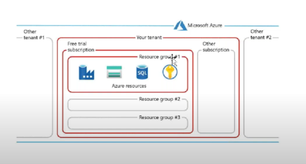
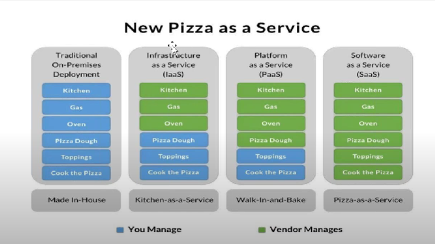
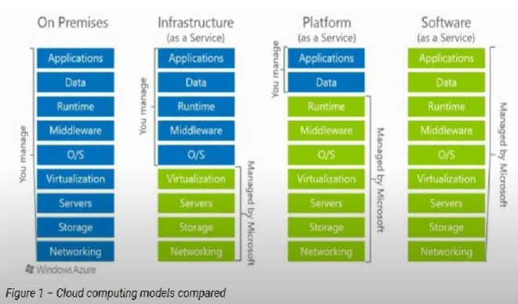

# What is Azure
Azure is a cloud computing service provider by microsoft where users can create server,storage system and database here all the data center and physical infrastructure is maintained by microsoft 

### Why cloud 
* We need to avoid capital expenditure 
* It provides virtual machines 
* It's provide best security features 
* No infra team is required to maintain infrastructure 
* Service provider will maintain storage 
* Automatic software updates
* scale resource 
### Types of cloud computing
1) Public cloud
2) Hybrid cloud 
3) Private cloud

### Types of cloud services 

1) IAAS(ex: Empty plat)
2) PAAS(ex: Plat with some equipment)
3) SAAS(Ex : Hotel)

### Services technical perspective 

