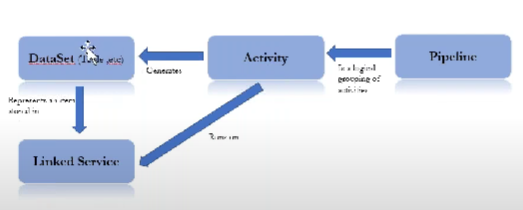

# ADG

---
Azure data factory is a fully managed, serverless data integration service from source to target which help to prepare, ingest and transform huge amount of data based on business logic.

### Building blocks of data factory

### pipline 
* Logical grouping of activities together perform task
* A data factory can have one or more pipline

### Activity
* The activities of a pipline define actions to perform on your data
* **Data factory supports three kind of activities** 
  1) data movement activities 
  2) data transformation activities
  3) data control activities 

### DataSets
* Identify data within different data store, such as table,file, document 
* Before you create a data set you must be create linked service to link your datastore to data factory 

### Linked service
* Linked service are much like connection strings,which define the connection information needed for data factory to connect external storage
* To copy a data from blob storage to sql database we need two linked service: azure storage and azure SQL database

### 